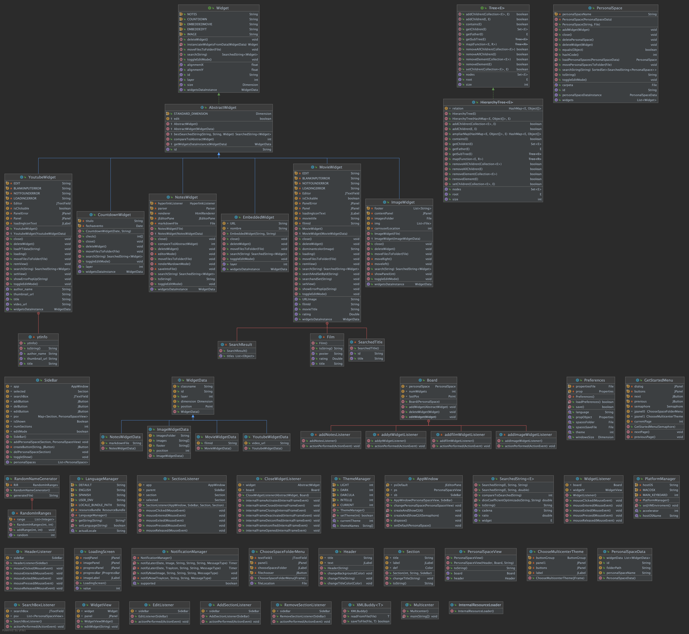

Multicenter es un espacio de trabajo diseñado para optimizar la organización de archivos multimedia, texto plano y utilidades de distintos usos (música, agenda personal, etc.). Está pensado para estudiantes, aunque no es de uso exclusivo. La mejora en la presentación de la información es el máximo beneficio y nuestra meta es que ayude a todos los usuarios posibles.

## Acknowledgement

- [Image icon](https://www.flaticon.es/icono-gratis/imagen_685681?term=image&page=1&position=15&page=1&position=15&related_id=685681&origin=search)
- [Claqueta icon](https://www.flaticon.es/icono-gratis/claqueta_4812530?term=film&page=1&position=91&page=1&position=91&related_id=4812530&origin=search)
- [Notes icon](https://www.flaticon.es/icono-gratis/publicalo_889648?term=notes&page=1&position=4&page=1&position=4&related_id=889648&origin=search)