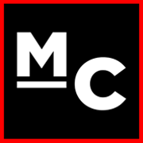
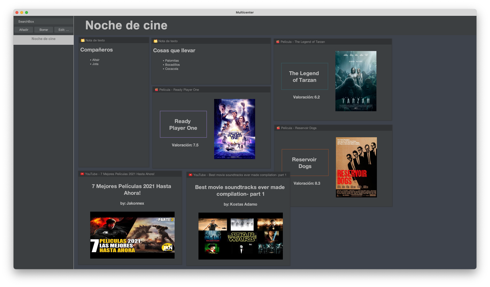
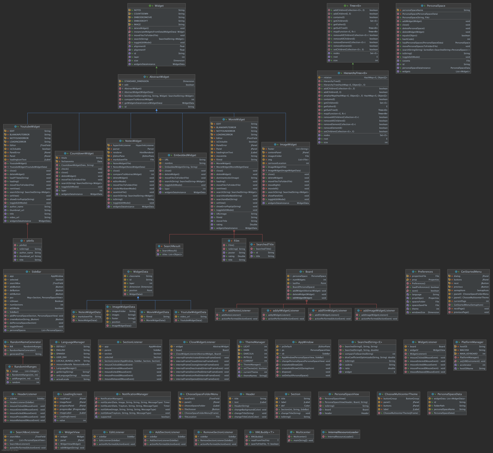

<h3 align="center">
    
</h3>

# Bienvenido a Multicenter

Multicenter es un espacio de trabajo diseñado para optimizar la organización de
archivos multimedia, texto plano y utilidades de distintos usos (música, agenda
personal, etc.). Está pensado para estudiantes, aunque no es de uso exclusivo.
La mejora en la presentación de la información es el máximo beneficio y nuestra
meta es que ayude a todos los usuarios posibles.



# Sobre el proyecto



## Workflows

- [default-project-board-action](https://github.com/skeet70/default-project-board-action):
  GitHub action para añadir los issues automaticamente al tablero Kanban de la
  pestaña "proyectos"
- [todo-to-issue-action](https://github.com/alstr/todo-to-issue-action): GitHub
  action para crear issues a partir de comentarios TODO en el código
- [building-and-testing-java-with-maven](https://docs.github.com/es/actions/guides/building-and-testing-java-with-maven):
  Github action para crear .jar de forma automática

## Contributing

Ver [contributing](./CONTRIBUTING)

## Acknowledgement

Librerías y recursos utilizados para la realización de este proyecto

- [Image icon](https://www.flaticon.es/icono-gratis/imagen_685681?term=image&page=1&position=15&page=1&position=15&related_id=685681&origin=search)
- [Claqueta icon](https://www.flaticon.es/icono-gratis/claqueta_4812530?term=film&page=1&position=91&page=1&position=91&related_id=4812530&origin=search)
- [Notes icon](https://www.flaticon.es/icono-gratis/publicalo_889648?term=notes&page=1&position=4&page=1&position=4&related_id=889648&origin=search)
- [Temas FlatLaf](https://github.com/JFormDesigner/FlatLaf)
- [Unirest API](https://github.com/Kong/unirest-java)
- [JUnit](https://junit.org/junit5/)
- [Mockito](https://site.mockito.org/)

# Build

Para construir el proyecto es necesario tener instalado en el equipo Maven. Para
más información sobre Maven, visita la web de
[Apache](https://maven.apache.org/). Para crear un .app y su correspondiente
.dmg, usa el script [build_macos.sh](build_macos.sh). En Windows y Linux,
ejecute en consola la siguiente línea:

```
mvn clean compile assembly:single -Dmaven.test.skip=true -B
```

# About

Proyecto para la asignatura de Introdución a la Ingeniería del Software de la
Universidad de Málaga. Realizado por:

- [Antona Espejo, Jesús](https://github.com/JantonaE)
- [Bueno Calvente, Altair](https://github.com/Altair-Bueno)
- [Bueno Pachón, José Luis](https://github.com/jxtaaa)
- [González Ortega, Carmen](https://github.com/carmengo01)
- [Hernández Martín, Francisco](https://github.com/fran1215)
- [Lopez Ranilla, Rubén](https://github.com/rubenlopran)
- [Marín Corbera, Carlos](https://github.com/CTMarin)
- [Sepúlveda Zorrilla, Antonio](https://github.com/antoniosep)

